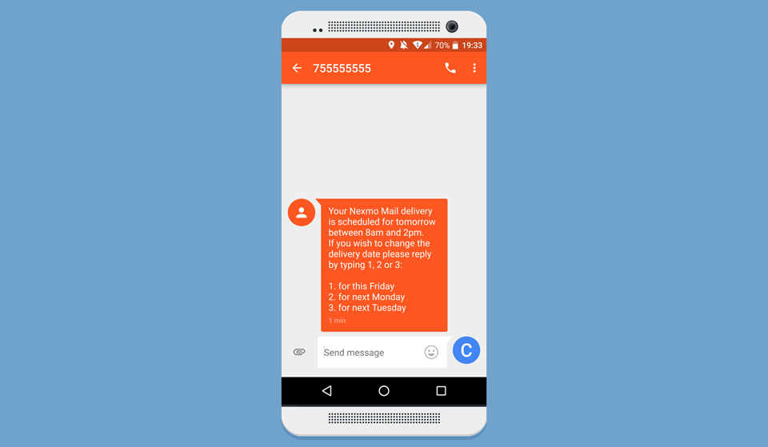

# Nexmo Delivery Notification Service in Express

A demo that implements a Delivery Notification Service in Express and the [Nexmo Text Messages API](https://www.nexmo.com/products/sms/).



## Submitting a number

The [number-form](../../tree/number-form) branch is the starting point of the tutorial and is just a simple Express app that lets a user submit a phone number.

### Usage

First off ensure you have Node installed.

- Clone this repository
- Run `git checkout number-form`
- Run `npm install`
- Run `npm start`
- Visit <http://localhost:3000>
- Submit a number

## Sending delivery notifications

The [delivery-notifications](../../tree/deliver-noytifications) branch is the end point of our tutorial, taking the number submitted and sending a notification to the user. Additionally it listens to incoming SMS messages to confirm a user's choice.

The differences between these two branches can be seen [here](../../compare/number-form...delivery-notifications) and in our in-dept tutorial.

### Usage

- Clone this repository
- Run `git checkout delivery-notifications`
- Run `npm install`
- Copy `.env.example` to `.env` and add your [Nexmo API key and secret](https://dashboard.nexmo.com/settings), and add Nexmo phone number
- Run `npm start`
- Visit <http://localhost:3000>
- Submit your own phone number

### Incoming messages

To receive incoming messages make sure your local server is available publicly. An easy way to do this is to use [Ngrok](https://ngrok.com/).

Then set up your SMS webhook which is easy to do with the [nexmo-cli](https://github.com/nexmo/nexmo-cli).

```sh
nexmo link:sms 445555555555 http://<your_id>.ngrok.com/response
```

## License

This sample is released under the [MIT License][license]

[license]: LICENSE.txt
